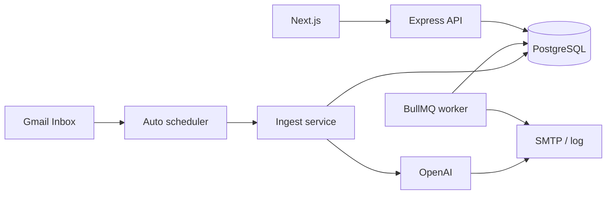

# Loan CRM — automated email follow-up (MVP)

Internal-only system for loan officers. It polls a Gmail inbox, ingests inbound leads, writes lead threads to PostgreSQL, sends AI-assisted SMTP replies, and schedules day 1/3/7 follow-ups with BullMQ.

## Prerequisites

- Node 20+
- Docker (for Postgres + Redis) or your own instances

## Quick start

1. **Infrastructure**

   ```bash
   docker compose up -d
   ```

2. **Environment**

   Copy `server/.env.example` to `server/.env` and set at least:

   - `OPENAI_API_KEY` — AI parsing + reply generation
   - `SMTP_*` — outbound email delivery
   - `GMAIL_CLIENT_ID`, `GMAIL_CLIENT_SECRET`, `GMAIL_REFRESH_TOKEN` — Gmail polling
   - `AUTO_POLL_MINUTES` — scheduler interval (2-5, default 3)
   - `EXTERNAL_APPLICATION_URL` — final destination for tracked clicks
   - `API_PUBLIC_URL` — **must** be the public URL of the Express API (e.g. `https://api.yourdomain.com`). Outbound emails use `API_PUBLIC_URL/r/{token}` for click tracking; `APP_BASE_URL` is the Next.js dashboard URL.
   - `APP_BASE_URL` — dashboard URL (e.g. `https://app.yourdomain.com`)
   - `ALLOWED_ORIGINS` — comma-separated CORS allowlist (usually your dashboard domain)
   - `SESSION_SECRET` — required in production; long random string
   - `AUTH_SEED_EMAIL`, `AUTH_SEED_PASSWORD` — initial loan officer login

3. **Install & API**

   ```bash
   npm install
   npm run dev -w server
   ```

   The API runs on port **4000**, applies `schema.sql` on startup, starts the follow-up worker, and starts Gmail auto-polling in the same process.

4. **Web**

   ```bash
   npm run dev -w web
   ```

   Open [http://localhost:3000/dashboard](http://localhost:3000/dashboard). Browser calls to `/api/*` are rewritten to the API (default `http://localhost:4000`).

## Try the flow

**Simulate an inbound email** (creates/updates lead, AI reply, schedules follow-ups):

On **macOS / Linux / Git Bash**, use real `curl`:

```bash
curl -X POST http://localhost:4000/api/ingest/email \
  -H "Content-Type: application/json" \
  -d '{"fromEmail":"borrower@example.com","fromName":"Alex","subject":"Loan question","rawBody":"Hi, I am interested in a mortgage and my phone is 555-0100."}'
```

On **Windows PowerShell**, `curl` is an alias for `Invoke-WebRequest` and does **not** accept `-X` / `-H` / `-d`. Use `Invoke-RestMethod` (or call the real binary: `curl.exe` with the same flags as above):

```powershell
Invoke-RestMethod -Method POST -Uri "http://localhost:4000/api/ingest/email" `
  -ContentType "application/json" `
  -Body '{"fromEmail":"borrower@example.com","fromName":"Alex","subject":"Loan question","rawBody":"Hi, I am interested in a mortgage and my phone is 555-0100."}'
```

**Manual Gmail poll** (optional; scheduler already runs automatically):

- `POST /api/mail/gmail`

## Main API

| Area | Routes |
|------|--------|
| Auth | `POST /api/auth/login`, `POST /api/auth/logout`, `GET /api/auth/me` |
| Leads | `GET /api/leads`, `GET /api/leads/:id`, `GET /api/leads/:id/emails`, `PATCH /api/leads/:id`, `PATCH /api/leads/:id/archive`, `GET /api/leads/export/csv` |
| Ingest | `POST /api/ingest/email` (auth required) |
| Mail poll | `POST /api/mail/gmail` (auth required) |
| Redirect tracking | `GET /r/:token` |

## Architecture (high level)



## Production notes

- Run API with process supervision; it includes worker + scheduler in the same process.
- Deploy with public HTTPS domains:
  - `APP_BASE_URL=https://app.<your-domain>`
  - `API_PUBLIC_URL=https://api.<your-domain>`
- Keep only `GET /r/:token` public. Dashboard and `/api/*` should require authentication.
- Tune `MAX_EMAILS_PER_LEAD_PER_DAY` and `MIN_MINUTES_BETWEEN_SENDS` for compliance.
- Use managed Postgres/Redis or highly available equivalents.

## Go-live verification checklist

1. **Auth**
   - Login works at `/login` with seed credentials.
   - `/dashboard` redirects to `/login` when signed out.
2. **Tracked link**
   - Outbound email contains `https://api.<domain>/r/<token>`.
   - Clicking link records click + redirects to `EXTERNAL_APPLICATION_URL`.
3. **Ingestion + automation**
   - Gmail polling runs automatically every interval.
   - `POST /api/mail/gmail` works when authenticated.
4. **Follow-up suppression**
   - Follow-ups stop after click/reply/opt-out.
5. **Dashboard + CSV**
   - Lead list/detail render correctly.
   - CSV export includes active + archived leads.
